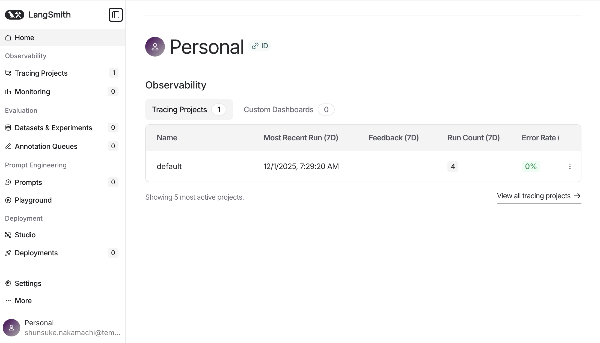
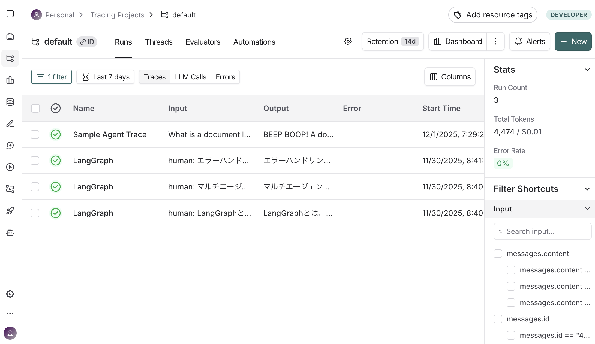
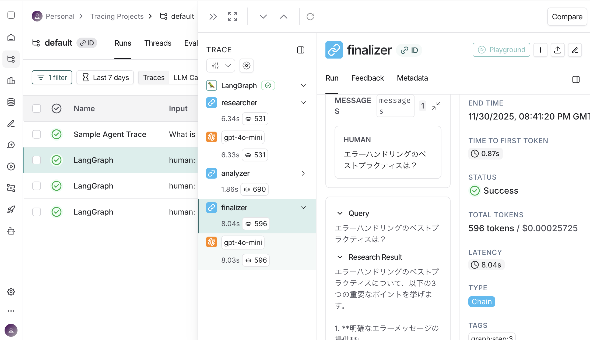

# LangSmith入門
LangChain/LangGraphアプリケーションの開発、テスト、評価、監視を統合的に支援するLangSmithの使い方を学ぶためのロードマップです。
まずtrainingフォルダ内の各セクションのコードを理解して、LangGraphアプリケーションのデバッグと監視のスキルを身につけましょう。

## 1. LangSmith（トレーシング・デバッグ）
LangGraphアプリケーションを開発していると、以下のような問題に直面します：
- **どのノードで何が起きたか分からない**: 複数のノードが実行されると、どこで問題が起きたか特定が困難
- **LLMへの入力と出力が確認できない**: プロンプトが正しく生成されているか、レスポンスが期待通りか確認できない
- **エラーの原因が特定できない**: エラーが発生しても、どのノードで、どんな入力で発生したか分からない
- **パフォーマンスの問題が分からない**: どのノードが遅いか、どこで時間がかかっているか分からない

学ぶべきこと: 環境変数の設定、自動トレーシング、LangSmith UIでの確認、デバッグの活用、パフォーマンス分析
なぜ必要か: LangSmithは、実行過程の可視化、詳細なログ記録、デバッグの効率化、パフォーマンス分析、チームでの共有を可能にします。実務では、LangSmithなしで開発するのは困難で、開発効率を大幅に向上させる強力なツールです。

## 使用しているライブラリ

それぞれのライブラリ（モジュール）の役割について解説します。これらは LangSmith でアプリを監視・デバッグする際の「標準セット」のようなものです。

### 1. 環境設定・型定義

```python
from dotenv import load_dotenv
```

*   **役割**: `.env` ファイルに書かれた内容（APIキーなど）を読み込んで、プログラム内で使えるようにします。
*   **なぜ必要か**: LangSmith の API キーなどをコードに直書きするのは危険なので、隠しファイル（.env）から読み込むのが定石だからです。

```python
from typing import TypedDict, Annotated
```

*   **役割**: Python の標準機能で、「型（データの形）」を定義するためのものです。
*   **なぜ必要か**: LangGraph では `State`（会話の状態）がどのような形をしているかを厳密に定義する必要があるため、これらを使って「辞書型だけど、中身はこうなってますよ」と宣言します。

### 2. AI モデル

```python
from langchain_openai import ChatOpenAI
```

*   **役割**: OpenAI の GPT モデル（gpt-4o など）を Python から簡単に使えるようにした「ラッパー（包み紙）」です。
*   **なぜ必要か**: 生の API を叩くよりも、LangChain/LangGraph のシステムに組み込みやすい形で提供されているためです。

### 3. グラフ構築（LangGraph の核）

```python
from langgraph.graph import StateGraph, START, END
```

*   **役割**:
    *   `StateGraph`: グラフそのものを作る「設計図」の土台です。
    *   `START`: グラフの「入口」を表す特別な定数です。
    *   `END`: グラフの「出口（終了）」を表す特別な定数です。
*   **なぜ必要か**: 「ここから始まって（START）、この処理をして、ここで終わる（END）」という流れを作るために必須です。

```python
from langgraph.graph.message import add_messages
```

*   **役割**: 「新しいメッセージが来たら、古いリストの後ろに追加（append）する」という動きをする**特別な関数**です。
*   **なぜ必要か**: これを使わないと、新しいメッセージが来るたびに古い履歴が上書きされて消えてしまいます。「履歴を積み上げていく」動作のために `Annotated[list, add_messages]` という形で使います。

### 4. LangSmith（トレーシング・デバッグ）

```python
import os
```

*   **役割**: 環境変数を読み込むために使用します。
*   **なぜ必要か**: LangSmith の設定（`LANGCHAIN_TRACING_V2`、`LANGCHAIN_API_KEY`、`LANGCHAIN_PROJECT`）は環境変数で行うためです。

**環境変数の設定**:
```env
LANGCHAIN_TRACING_V2=true
LANGCHAIN_API_KEY=your_api_key_here
LANGCHAIN_PROJECT=langgraph-practice
```

*   **役割**: LangSmith のトレーシングを有効にし、実行ログを記録します。
*   **なぜ必要か**: 
    *   `LANGCHAIN_TRACING_V2=true`: トレーシングを有効にする
    *   `LANGCHAIN_API_KEY`: LangSmith の API キー（必須）
    *   `LANGCHAIN_PROJECT`: プロジェクト名（省略可、デフォルトは"default"）
    *   環境変数が設定されているだけで、**自動的にトレーシングが開始**されます。特別なコードを書く必要はありません。

---

## Training で使用しているライブラリ一覧

以下は `training/requirements.txt` に記載されているライブラリの詳細説明です。

### LangChain / LangGraph コアライブラリ（重要）

#### `langgraph` (1.0.4)

```python
from langgraph.graph import StateGraph, START, END
```

*   **役割**: LangGraph の本体。`StateGraph` を使ってエージェントのワークフロー（処理の流れ）を構築します。
*   **なぜ必要か**: 
    *   `StateGraph` はグラフそのものを作る「設計図」の土台です。
    *   `START` はグラフの「入口」、`END` は「出口（終了）」を表す特別な定数です。
    *   「ここから始まって（START）、この処理をして、ここで終わる（END）」という流れを作るために必須です。

#### `langgraph-checkpoint` (3.0.1)

```python
from langgraph.checkpoint.memory import MemorySaver
```

*   **役割**: 永続化（Checkpointer）の機能を提供。会話の状態（State）をメモリやデータベースに保存します。
*   **なぜ必要か**: 
    *   これをグラフにセット（`checkpointer=memory`）することで、`thread_id` を指定して「さっきの続きから」会話を再開できるようになります。
    *   `MemorySaver`（メモリ保存）、`PostgresSaver`（データベース保存）などが含まれます。
    *   本番環境では `PostgresSaver` に変えるだけで、本格的な永続化に切り替えられます。

#### `langgraph-prebuilt` (1.0.5)

*   **役割**: よく使われるノードやツールの事前構築済みコンポーネント。
*   **なぜ必要か**: 一般的なパターン（例：ツール呼び出しノード、条件分岐ノード）を自分で実装せずに使えるため、開発が速くなります。

#### `langgraph-sdk` (0.2.10)

*   **役割**: LangGraph のクライアント SDK。リモートグラフ（別のサーバーで動いているグラフ）の呼び出しなどに使用。
*   **なぜ必要か**: マイクロサービス構成で、グラフを API として公開する場合に必要になります。

#### `langchain` (1.1.0)

*   **役割**: LangChain の本体。LLM との統合、プロンプト管理、チェーン構築などの基盤ライブラリ。
*   **なぜ必要か**: LangGraph は LangChain の上に構築されているため、基盤として必要です。プロンプトテンプレートやドキュメントローダーなどの便利機能も提供します。

#### `langchain-core` (1.1.0)

```python
from langchain_core.messages import HumanMessage, AIMessage
```

*   **役割**: LangChain のコア機能（メッセージ、ランナブル、ツールなど）を提供。
*   **なぜ必要か**: 
    *   `HumanMessage`（ユーザーからのメッセージ）、`AIMessage`（AI の返答）などのメッセージ型を定義します。
    *   LangGraph の State で使う `messages` リストは、これらのメッセージオブジェクトで構成されます。

#### `langchain-openai` (1.1.0)

```python
from langchain_openai import ChatOpenAI
```

*   **役割**: OpenAI の API（ChatGPT など）を LangChain から簡単に使うためのラッパー（包み紙）。
*   **なぜ必要か**: 
    *   OpenAI の GPT モデル（gpt-4o など）を Python から簡単に使えるようにします。
    *   生の API を叩くよりも、LangChain/LangGraph のシステムに組み込みやすい形で提供されています。

#### `langsmith` (0.4.48)

*   **役割**: LangChain/LangGraph のトレーシング・デバッグツール。実行ログを可視化できます。
*   **なぜ必要か**: 
    *   グラフの実行過程（どのノードがいつ実行されたか、LLM に何を送ったか、何が返ってきたか）を記録・可視化できます。
    *   デバッグや性能分析に非常に便利です（オプション機能）。
    *   **自動トレーシング**: 環境変数が設定されているだけで、自動的にトレーシングが開始されます。特別なコードを書く必要はありません。

### その他の重要なライブラリ

#### `python-dotenv` (1.2.1)

```python
from dotenv import load_dotenv
```

*   **役割**: `.env` ファイルに書かれた内容（API キーなど）を読み込んで、プログラム内で使えるようにします。
*   **なぜ必要か**: OpenAI や LangSmith の API キーなどをコードに直書きするのは危険なので、隠しファイル（.env）から読み込むのが定石だからです。

#### `pydantic` (2.12.5)

```python
from typing import TypedDict, Annotated
```

*   **役割**: データバリデーションと設定管理。State の型定義などに使用されます。
*   **なぜ必要か**: LangGraph では `State`（会話の状態）がどのような形をしているかを厳密に定義する必要があるため、これらを使って「辞書型だけど、中身はこうなってますよ」と宣言します。

### その他のサポートライブラリ

### AI・LLM 関連

| ライブラリ | バージョン | 役割 |
|-----------|-----------|------|
| `openai` | 2.8.1 | OpenAI の公式 Python クライアント。GPT-4 などの API を直接呼び出せます。 |
| `tiktoken` | 0.12.0 | OpenAI のトークナイザー。テキストをトークンに分割してトークン数をカウントします。 |

### データ処理・バリデーション

| ライブラリ | バージョン | 役割 |
|-----------|-----------|------|
| `pydantic` | 2.12.5 | データバリデーションと設定管理。State の型定義などに使用されます。 |
| `pydantic_core` | 2.41.5 | Pydantic のコア機能（Rust で高速化されています）。 |
| `typing_extensions` | 4.15.0 | Python の型ヒント機能を拡張。Annotated などの新しい型機能を提供。 |
| `typing-inspection` | 0.4.2 | 型情報のランタイム検査をサポート。 |

### HTTP・ネットワーク

| ライブラリ | バージョン | 役割 |
|-----------|-----------|------|
| `httpx` | 0.28.1 | 非同期 HTTP クライアント。外部 API 呼び出しに使用（requests の非同期版）。 |
| `httpcore` | 1.0.9 | httpx の低レベル HTTP コア機能。 |
| `requests` | 2.32.5 | 同期 HTTP クライアント。シンプルな API 呼び出しに使用。 |
| `requests-toolbelt` | 1.0.0 | requests の拡張ツール（マルチパート、ストリーミングなど）。 |
| `urllib3` | 2.5.0 | HTTP クライアントの基盤ライブラリ。 |
| `certifi` | 2025.11.12 | SSL 証明書の検証に使用される信頼できる CA バンドル。 |

### JSON・データシリアライゼーション

| ライブラリ | バージョン | 役割 |
|-----------|-----------|------|
| `orjson` | 3.11.4 | 高速な JSON シリアライザー（Rust 実装）。 |
| `ormsgpack` | 1.12.0 | MessagePack のシリアライザー。バイナリ形式でデータを効率的に保存。 |
| `jsonpatch` | 1.33 | JSON Patch（RFC 6902）の実装。差分更新に使用。 |
| `jsonpointer` | 3.0.0 | JSON Pointer（RFC 6901）の実装。JSON 内の特定の値を参照。 |
| `jiter` | 0.12.0 | 高速な JSON イテレーター。 |

### ユーティリティ

| ライブラリ | バージョン | 役割 |
|-----------|-----------|------|
| `python-dotenv` | 1.2.1 | `.env` ファイルから環境変数を読み込む。API キーの管理に必須。 |
| `dotenv` | 0.9.9 | 古いバージョンの dotenv（python-dotenv を使うことを推奨）。 |
| `PyYAML` | 6.0.3 | YAML ファイルの読み書き。設定ファイルの管理に使用。 |
| `packaging` | 25.0 | パッケージバージョンの解析・比較。 |
| `tenacity` | 9.1.2 | リトライロジックの実装。API 呼び出しの失敗時に自動再試行。 |
| `tqdm` | 4.67.1 | プログレスバーの表示。長時間処理の進捗を可視化。 |

### グラフ・可視化

| ライブラリ | バージョン | 役割 |
|-----------|-----------|------|
| `grandalf` | 0.8 | グラフレイアウトアルゴリズム。LangGraph の可視化に使用。 |

### その他

| ライブラリ | バージョン | 役割 |
|-----------|-----------|------|
| `anyio` | 4.11.0 | 非同期 I/O の抽象化レイヤー。asyncio と trio の両方をサポート。 |
| `sniffio` | 1.3.1 | 実行中の非同期ライブラリを検出（asyncio か trio か）。 |
| `h11` | 0.16.0 | HTTP/1.1 プロトコルの低レベル実装。 |
| `idna` | 3.11 | 国際化ドメイン名（IDN）のエンコード・デコード。 |
| `charset-normalizer` | 3.4.4 | 文字エンコーディングの自動検出。 |
| `distro` | 1.9.0 | Linux ディストリビューション情報の取得。 |
| `regex` | 2025.11.3 | 高度な正規表現機能（標準 re モジュールの拡張）。 |
| `pyparsing` | 3.2.5 | テキストパーサーの構築ライブラリ。 |
| `xxhash` | 3.6.0 | 高速ハッシュアルゴリズム。 |
| `zstandard` | 0.25.0 | Zstandard 圧縮アルゴリズムの Python バインディング。 |
| `annotated-types` | 0.7.0 | Pydantic で使用される型アノテーション。 |


これらのライブラリは LangSmith を使った LangGraph アプリケーション開発の標準的なスタックです。必要に応じて追加のライブラリ（例：データベース接続用の `psycopg2`、Web フレームワーク用の `fastapi` など）をインストールしてください。

## LangSmith UIでの確認方法

### 1. LangSmith UIにアクセス

1. https://smith.langchain.com/ にアクセス
2. ログイン
3. 左側のメニューから「Projects」を選択
4. プロジェクト名（`LANGCHAIN_PROJECT`で設定した名前）をクリック



### 2. 実行履歴の確認

- **Traces**: 実行履歴の一覧が表示されます
- 各実行をクリックすると、詳細が表示されます



### 3. ノードごとの詳細確認

各ノードをクリックすると、以下が確認できます：

- **Inputs**: ノードへの入力（Stateの内容）
- **Outputs**: ノードからの出力
- **LLM Calls**: LLMへの呼び出し詳細
  - プロンプト
  - レスポンス
  - トークン使用量
  - 実行時間



### 4. エラーの追跡

エラーが発生した場合：

- エラーが発生したノードが赤く表示されます
- エラーメッセージとスタックトレースが表示されます
- エラー発生時のStateが確認できます

### 5. パフォーマンス分析

- **実行時間**: 各ノードの実行時間が表示されます
- **トークン使用量**: 入力・出力トークン数が表示されます
- **コスト**: トークン使用量からコストが計算されます

## 実務での活用例

### 1. デバッグ

**問題**: 「なぜこのノードでエラーが発生するのか？」

**解決方法**:
1. LangSmith UIでエラーが発生した実行を開く
2. エラーが発生したノードを確認
3. そのノードへの入力（State）を確認
4. LLMへのプロンプトを確認
5. 問題の原因を特定

### 2. パフォーマンス最適化

**問題**: 「処理が遅い。どこがボトルネックか？」

**解決方法**:
1. LangSmith UIで実行時間を確認
2. 各ノードの実行時間を比較
3. 遅いノードを特定
4. 最適化の対象を決定

### 3. コスト管理

**問題**: 「トークン使用量が多すぎる。どこで使われているか？」

**解決方法**:
1. LangSmith UIでトークン使用量を確認
2. 各ノードのトークン使用量を比較
3. 多いノードを特定
4. プロンプトの最適化やキャッシュの導入を検討

### 4. プロンプトの改善

**問題**: 「LLMの出力が期待通りでない。プロンプトに問題があるか？」

**解決方法**:
1. LangSmith UIでLLMへの入力（プロンプト）を確認
2. 実際の出力を確認
3. プロンプトを改善
4. 再実行して結果を比較

## 参考リンク

- **LangSmith公式サイト**: https://smith.langchain.com/
- **LangSmithドキュメント**: https://docs.smith.langchain.com/
- **APIキーの取得**: https://smith.langchain.com/settings

